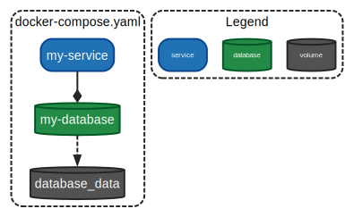

# docker-compose-graph

## Example

```sh
❯ go run main.go example/docker-compose.yaml

digraph compose {
  graph [fontname = "arial"];
  node  [fontname = "arial"];
  edge  [fontname = "arial" color = "/greys8/8"];
  subgraph cluster_0 {
      label = "docker-compose.yaml"
      shape = "box"
      style = "rounded,bold,dashed"
      color = "/greys8/8"
    database_data                        [shape = "cylinder"   style = "rounded,bold,filled"    fillcolor = "/greys8/7"  color = "/greys8/8"  fontcolor = "white"      label = "database_data"];
    my_database                          [shape = "cylinder"   style = "rounded,bold,filled"    fillcolor = "/bugn8/7"   color = "/bugn8/8"   fontcolor = "white"      label = "my-database"];
    my_service                           [shape = "box"        style = "rounded,bold,filled"    fillcolor = "/blues8/7"  color = "/blues8/8"  fontcolor = "white"      label = "my-service"];
  }
  subgraph cluster_1 {
      label = "Legend"
      shape = "box"
      style = "rounded,bold,dashed"
      color = "/greys8/8"
    service                              [shape = "box"        style = "rounded,bold,filled"    fillcolor = "/blues8/7"  color = "/blues8/8"  fontcolor = "white"      fontsize = "8pt"  label = "service"];
    database                             [shape = "cylinder"   style = "rounded,bold,filled"    fillcolor = "/bugn8/7"   color = "/bugn8/8"   fontcolor = "white"      fontsize = "8pt"  label = "database"];
    volume                               [shape = "cylinder"   style = "rounded,bold,filled"    fillcolor = "/greys8/7"  color = "/greys8/8"  fontcolor = "white"      fontsize = "8pt"  label = "volume"];
  }
  my_database                            -> database_data                          [style="bold,dashed"];
  my_service                             -> my_database                            [arrowhead="diamond" style="bold"];
}
```

To generate an image, pipe the output to `dot`:

```sh
❯ go run main.go example/docker-compose.yaml | dot -Tsvg > example/docker-compose.svg

```


