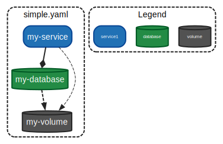

# docker-compose-graph

A simple command-line tool that constructs a [DOT][1] graph of service and
volume dependencies within a given set of [docker-compose][2] files.

## Usage example

```sh
❯ go run main.go examples/simple.yaml

digraph compose {
  graph [fontname = "arial"];
  node  [fontname = "arial"];
  edge  [fontname = "arial" color = "/greys8/8"];
  subgraph cluster_0 {
      label = "simple.yaml"
      shape = "box"
      style = "rounded,bold,dashed"
      color = "/greys8/8"
    my_database                          [shape = "cylinder"   style = "rounded,bold,filled"    fillcolor = "/bugn8/7"   color = "/bugn8/8"   fontcolor = "white"      label = "my-database"];
    my_service                           [shape = "box"        style = "rounded,bold,filled"    fillcolor = "/blues8/7"  color = "/blues8/8"  fontcolor = "white"      label = "my-service"];
    my_volume                            [shape = "cylinder"   style = "rounded,bold,filled"    fillcolor = "/greys8/7"  color = "/greys8/8"  fontcolor = "white"      label = "my-volume"];
  }
  subgraph cluster_1 {
      label = "Legend"
      shape = "box"
      style = "rounded,bold,dashed"
      color = "/greys8/8"
    service                              [shape = "box"        style = "rounded,bold,filled"    fillcolor = "/blues8/7"  color = "/blues8/8"  fontcolor = "white"      fontsize = "8pt"  label = "service"];
    database                             [shape = "cylinder"   style = "rounded,bold,filled"    fillcolor = "/bugn8/7"   color = "/bugn8/8"   fontcolor = "white"      fontsize = "8pt"  label = "database"];
    volume                               [shape = "cylinder"   style = "rounded,bold,filled"    fillcolor = "/greys8/7"  color = "/greys8/8"  fontcolor = "white"      fontsize = "8pt"  label = "volume"];
  }
  my_database                            -> my_volume                              [style="bold,dashed"];
  my_service                             -> my_database                            [arrowhead="diamond" style="bold"];
  my_service                             -> my_volume                              [style="dashed"];
}
```

To generate an image, pipe the output to `dot`:

```sh
❯ go run main.go examples/simple.yaml | dot -Tsvg > examples/simple.svg

```



[1]: https://en.wikipedia.org/wiki/DOT_%28graph_description_language%29
[2]: https://docs.docker.com/compose/
